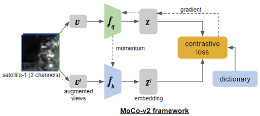
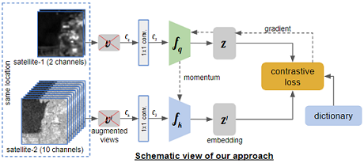

## Abstract

We present a sensor-based location invariance momentum contrast for unsupervised visual representation learning in remote sensing application, where unlabeled data is well-known challenges to deep learning domain and accurate training data remains comparably scarce. In this study, we first introduce the use of SEN12MS datasets, a curated large-scale training data that include versatile remote sensing information from different sensors with global scene distributions. To continually bridge the gap between supervised and unsupervised learning on computer vision tasks in remote sensing application, we exploit the geo-alignment data structure from SEN12MS and construct sensor-based geo-alignment positive pairs in contrastive learning to design the natural augmentation. [last sentence subject to changes] Our experiments show that the proposed method outperforms the supervised learning counterpart when transferring to downstream tasks in scene classification for remote sensing data.

## Introduction
The performance of deep convolutional neural networks depends on their capability and the amount of training data. The datasets are becoming larger in every domain and different kinds of network architectures like [VGG](https://arxiv.org/pdf/1409.1556.pdf), [GoogLeNet](https://arxiv.org/pdf/1409.4842.pdf), [ResNet](https://arxiv.org/pdf/1512.03385.pdf), [DenseNet](https://arxiv.org/pdf/1608.06993.pdf), etc., increased network models' capacity.  

However, the collection and annotation of large-scale datasets are time-consuming and expensive. Many self-supervised methods were proposed to learn visual features from large-scale unlabeled data without using any human annotations to avoid time-consuming and costly data annotations.  Contrastive learning of visual representations has emerged as the front-runner for self-supervision and has demonstrated superior performance on downstream tasks. All contrastive learning frameworks involve maximizing agreement between positive image pairs relative to negative/different images via a contrastive loss function; this pretraining paradigm forces the model to learn good representations. These approaches typically differ in how they generate positive and negative image pairs from unlabeled data and how the data are sampled during pretraining.  

Self-supervised approaches such as  Momentum  Contrast  (MoCo)  ([He et al.,  2019](https://arxiv.org/pdf/1911.05722.pdf);  [Chen et al.,2020](https://arxiv.org/pdf/2003.04297.pdf))  can leverage unlabeled data to produce pre-trained models for subsequent fine-tuning on labeled data.   In addition to MoCo,  these include frameworks such as SimCLR ([Chen et al., 2020](https://arxiv.org/pdf/2002.05709.pdf)) and PIRL ([Misra and Maaten, 2020](https://openaccess.thecvf.com/content_CVPR_2020/papers/Misra_Self-Supervised_Learning_of_Pretext-Invariant_Representations_CVPR_2020_paper.pdf)).  

Remote sensing data has become broadly available at the petabyte scale, offering unprecedented visibility into natural and human activity across the Earth. In remote sensing, labeled data is usually scarce and hard to obtain. Due to the success of self-supervised learning methods, we explore their application to large-scale remote sensing datasets.  

While most self-supervised image analysis techniques focus on natural imagery, remote sensing differs in several critical ways. Natural imagery often has one subject; remote sensing images contain numerous objects such as buildings, trees, roads, rivers, etc. Additionally, the important content changes unpredictably within just a few pixels or between images at the same location from different times. Multiple satellites capture images of the same locations on earth with a wide variety of resolutions, spectral bands (channels), and revisit rates, such that any specific problem can require a different
combination of sensor inputs([Reiche et al., 2018](https://doi.org/10.1016/j.rse.2017.10.034),[Rustowicz et al., 2019](https://openaccess.thecvf.com/content_CVPRW_2019/papers/cv4gc/Rustowicz_Semantic_Segmentation_of_Crop_Type_in_Africa_A_Novel_Dataset_CVPRW_2019_paper.pdf)).  

While MoCo and other contrastive learning methods have demonstrated promising results on natural image classification tasks, their application to remote sensing applications has been limited.  

Traditional contrative learning utilizes augmentation to generate positive pair. Inspired by recent success (Geo-aware Paper) using natural augmentation to create positive pairs, we propose to use positive pairs from different sensors for the same location.    

In this work, we demonstrate that pre-training [MoCo-v2](https://openaccess.thecvf.com/content_CVPR_2020/papers/He_Momentum_Contrast_for_Unsupervised_Visual_Representation_Learning_CVPR_2020_paper.pdf) on data from multiple sensors lead to improved representations for remote sensing applications.

## Related Work
#### Self-supervised contrastive learning
Many self-supervised learning methods for visual feature learning have been developed without using any
 human-annotated labels. Compared to supervised learning methods which require a data pair Xi
 and Yi while Yi is annotated by human labors, self-supervised learning also trained with data Xi along
 with its pseudo label Pi while Pi is automatically generated for a pre-defined pretext task without involving any
 human annotation. The pseudo label Pi can be generated by using attributes of images or videos such as the context of
 images or by traditional hand-designed methods. As long as the pseudo labels P are automatically generated
 without involving human annotations, then the methods belong to self-supervised learning. Recently, self-supervised
 learning methods have achieved great progress.  

 Self-supervised contrastive learning approaches such as [MoCo](https://arxiv.org/pdf/1911.05722.pdf) ,
 [MoCo-v2](https://arxiv.org/pdf/2003.04297.pdf), [SimCLR](https://arxiv.org/pdf/2002.05709.pdf), and [PIRL](https://openaccess.thecvf.com/content_CVPR_2020/papers/Misra_Self-Supervised_Learning_of_Pretext-Invariant_Representations_CVPR_2020_paper.pdf) have demonstrated
 superior performance and have emerged as the fore-runner on various downstream tasks. The intuition behind these
 methods are to learn representations by pulling positive image pairs from the same instance closer in latent space
 while pushing negative pairs from difference instances further away. These methods, on the other hand, differ in the
 type of contrastive loss, generation of positive and negative pairs, and sampling method.

 Contrastive learning of visual representations using MoCo ([**MoCo-v2**](https://arxiv.org/pdf/2003.04297.pdf) - Chen, et
 al., Facebook AI Research, 2020) has emerged as the front-runner for self-supervision and has demonstrated superior performance on downstream tasks.

#### Performance gap in Satellite imagery
There is a performance gap between supervised learning using labels and self-supervised contrastive learning method, [MoCo-v2](https://arxiv.org/pdf/2003.04297.pdf), on remote
 sensing datasets. For instance, on the Functional Map of the World ([fMoW](https://arxiv.org/abs/1711.07846)) image classification
 benchmark, there is an 8% gap in top 1 accuracy between supervised and self-supervised methods. By leveraging spatially aligned
 images over time to construct temporal positive pairs in contrastive learning and geo-location in the design of pre-text tasks, **[Geography-Aware
 Self-supervised Learning](https://arxiv.org/pdf/2011.09980.pdf)** (Ayush, et al., Stanford University, 2020) were able to
 close the gap between self-supervised and supervised learning on image classification, object detection and semantic
 segmentation on remote sensing and other geo-tagged image datasets.

In this work, we provide an effective approach for improving representation learning using data from different satellite imagery using [MoCo-v2](https://arxiv.org/pdf/2003.04297.pdf).

## Problem Definition
Does contrastive pre-training with data from multiple sensors lead to improved representations for remote sensing applications?  

Pre-train the contrastive model using unlabeled data from multiple satellites and use that model for downstream remote sensing tasks.  

We want to show that our approach to using images from different satellites for the same location as naturally augmented images as input to the MoCo-v2 method provides high-quality representations and transferable initializations for satellite imagery interpretation. Despite many differences in the data and task properties between natural image classification and satellite imagery interpretation, we want to show the benefit of MoCo-v2 pretraining across multiple patches from different satellites for satellite imagery and investigate representation transfer to a target dataset.   

### Datasets
- [todo] keep only sen12ms. 
-   
To validate our ideas, we did experiments on datasets with different satellite imageries with variations in dataset size, channels, and image ground resolutions. The statistics of these datasets are given below. Readers are requested to see the the supplementary materials for examples and additional details of these datasets.  
| Dataset  | Satellites  | Number of Images  | Image Size  |  Labels | Notes  |
|---|---|---|---|---|---|
| [BigEarthNet](https://arxiv.org/pdf/1902.06148.pdf)  | Sentinel-2A/B |590,326 patches; 12 Bands | 20x20 to 120x120  | Multiple, up to 43  | No overlapping; 10 European Countries |
| [SEN12MS](https://arxiv.org/pdf/1906.07789.pdf)   | Sentinel-1A/B; Sentinel-2A/B; MODIS (Terra and Aqua)  | 541,986 patches; 180662 triplets (3\*180662); 4, 2 and 13 Bands     | 256X256  | Single, 17 Full and 10 Simplified  | Partial overlapping |
| [FMoW](https://arxiv.org/abs/1711.07846)   | QuickBird-2; GeoEye-1; WorldView-2; WorldView-3  | 1,047,691 patches; 4, 8 and RGB Bands  | Variable Over 2500x2500  | Multiple, up to 63; Bounding Box Annotations | Includes False Detection; Variable timestamp overlapping  |

##### SEN12MS
The SEN12MS dataset contains 180,662 patch triplets of corresponding Sentinel-1 dual-pol SAR data, Sentinel-2 multi-spectral images, and MODIS-derived land cover maps. The patches are distributed across the land masses of the Earth and spread over all four meteorological seasons. This is reflected by the dataset structure. The captured scenes were tiled into patches of 256 X 256 pixels in size and implemented a stride of 128 pixels, resulting in an overlap between adjacent patches.
Only 3847 patches do not have any overlap with adjacent patches.
Most of the overlap occurs around 25% and 50% of the area with few patches overlapping less than 15% and more than 75%.

 All patches are provided in the form of 16-bit GeoTiffs containing the following specific information:
* Sentinel-1 SAR: 2 channels corresponding to sigma nought backscatter values in dB scale for VV and VH polarization.
* Sentinel-2 Multi-Spectral: 13 channels corresponding to the 13 spectral bands (B1, B2, B3, B4, B5, B6, B7, B8, B8a, B9, B10, B11, B12).
* MODIS Land Cover: 4 channels corresponding to IGBP, LCCS Land Cover, LCCS Land Use, and LCCS Surface Hydrology layers.

(TODO for Ernesto) should discuss dataset split for training and test (holdout set) 
- 32K set
- potential issue with full set 
- test set 
- 1K set 

## Method
In this section, we briefly review Contrastive Learning Framework for unsupervised learning and detail our proposed approach to improve Moco-v2, a recent contrastive learning framework, on satellite imagery from multiple sensors data.

**Multiple-Sensor**
Update on different bands, different satellites etc. with images.  

#### 1. Contrastive Learning Framework
Contrastive methods attempt to learn a mapping fq from raw pixels to semantically meaningful representations z in an unsupervised way. The training objective encourages representations corresponding to pairs of images that are known a priori to be semantically similar (positive pairs) to be closer to each other than typical unrelated pairs (negative pairs). With similarity measured by dot product, recent approaches in contrastive learning differ in the type of contrastive loss and generation of positive and negative pairs. In this work, we focus on the state-of-the-art contrastive learning framework [MoCo-v2](https://arxiv.org/pdf/2003.04297.pdf), an improved version of [MoCo](https://arxiv.org/pdf/1911.05722.pdf), and study improved methods for the construction of positive and negative pairs tailored to remote sensing applications.

#### 2. Sensors-based Geo-alignment Positive Pairs
Given the SEN12MS that provides the largest remote sensing dataset available with its global scene distribution and the wealth of versatile remote sensing information, It is natural to leverage the geo-alignment imagery from different remote sensing sensors  while constructing positive or negative pairs . For example, Sentinel 1 consists of two images (vertical and horizontal polarization) and Sentinel 2 consist of thirteen images (different wavelength bands) of the same patch. Any combination from the same patch would correspond to a positive pair without the need of additional augmentation, while negative pairs would correspond to any image from different patches without restriction of the same or different satellites. 

In short, given an image x_i(s1) collected from sentinel 1, we can randomly select another image x_i(s2) collected from sentinel 2 that is geographically aligned with the x_i(s1), and then have them passthrough MoCo-v2 to the geographically aligned image pair x_i(s1) and x_i(s2), which provides us with a sensor-based geo-alignment positive pair ( v and v’ in Figure xxx) that can be used for training the contrastive learning framework by the query and key encoders in MoCo-v2. 

For a sample of x_i(s1), our GeoSensorInforNCE objective loss can be demonstrated as follows:

***INSERT FIGURE HERE (GeoSensorInfoNCE)***

where z_i(s1) and z_i(s2) are the encoded representation of the randomly geo-aligned positive pair x_i(s1) and x_i(s2). N denotes the number of negative samples, {k_j}j=1_n are the encoded negative pairs, and \lambda is the temperature hyperparameter. 

What we used are the actual images from the same location but different sensors. With the inspiration of the success of geography-aware self-supvervised learing (insert ref -- **geo xxxxx paper** )that constructs temporal pairs from real images, we also rely on the assumptions that the actual images for positive pairs encourages the entire network to learn better representations for real sensors data than the one focusing on augmentation strategies and synthetic images. 
xxxxx

#### 3. 1x1 Convolution filters

From the above perspective of constructing naturally augmented positive and negative pairs in contrastive learning, we noticed that the volume (bands) of the inputs from different sensors are different. In order to match the typical dimensions of the image channels, our study also applies the Network in Network concept (Min Lin et al)(insert ref --**NIN**) to the sourced images. As such, we introduced an extra layer of one by one convolution filter block to perform cross channel sampling, thereby matching and aligning the depth of the channels from different sensor images while introducing non-linearity before the MoCo v2 encoding. With the implementation, we leverage this trick to carry out a pretty non-trivial computation on the input volume whereas we hope to increase the generalization capability in the network.  
  
#### 4. data fusion
(todo) architecture diagram 
Instead of the first approach, we data fusioned sentinel 1 (2 bands) and sentinel 2 images (10 bands) together with the same locations and apply a set of combinations of images including sentinel 1 and sentinel 2 together, sentinel 2 only, and sentinel 1 only to construct one fusioned image. In a sense that we build a straightforward constraving learning directly under MoCo v2. 

Similarly, our finetune/ transfer learning for the SEN12MS sense classification would adopt the same strategy for us to compare the evaluation results. We will continue to update and report.

## Experiments
#### Pre-training on SEN12MS

Pre-training is performed twice for comparison proposes. First, examples from all patches are included (180,662). Second, pre-train includes a sample of the dataset which patches do not overlap with their adjacent patches. This sample of the dataset is selected on firs come first serve basis and any adjacent overlapping patch is ignored. The selection consist of 35,792 patches.

The model is pre-trained on different scenarios to compare the performance of the model. ***First, the model is trained by using the original approach of MoCo V2. The input image is augmented by gaussian blur, elastic transformation, vertical and horizontal flip***. Second, the model with the approach proposed in this work that is using images from different satellites as positive pairs. ***Third, in order to generalize the model, augmentation is applied to both satellites during training***. The pre-train is also done with both the complete dataset and the non-overlapping sample described in the previous section.

The encoders have ***ResNet50*** architecture (50 layers deep, 2048 nodes) with 128 output nodes.
These encoders are designed for a RGB input (3 bands) and Sen12MS data set is 2, 4 and 13 bands for S1, LC and S2 respectively.  
To overcome this structure constrain, a convolutional layer is included before the encoders to map the input with different bands to 3.
***The weights of this layer are not updated during training***.
The momentum constant (***m***) is ***0.9*** and the learning rate is ***0.03***. The temperature factor for the loss function is ***0.2***. The batch size is ***64***.

#### Transfer Learning Experiments

We compared supervised learning with HPT model 

1. SEN12MS - Scene Classification 

- Supervised Learning Benchmark vs HPT model 

**Implementation Details **

- downloaded pretrained models from t 
- the original IGBP land cover scheme has 17 classes.
- the simplified version of IGBP classes has 10 classes, which derived and consolidated from the original 17 classes.

**Qualitative Analyis**

-   Supervised training (full dataset)
    -   baseline: downloaded the pre-trained the models and evaluate without finetuning.
-   Supervised training (1k dataset)
    -   Supervised: original ResNet50 used by Sen12ms
    -   Supervised_1x1: adding conv1x1 block to the ResNet50 used by Sen12ms
-   Finetune/transfer learning (1k dataset)
    -   Moco: the ResNet50 used by Sen12ms is initialized with the weight from Moco backbone
    -   Moco_1x1: adding conv1x1 block to the ResNet50 used by Sen12ms and both input module and ResNet50 layers are initialized with the weight from Moco
    -   Moco_1x1Rnd: adding conv1x1 block to the ResNet50 used by Sen12ms. ResNet50 layers are initialized with the weight from Moco but input module is initialized with random weights
-   Finetune v2 (1k dataset)
    -   freezing ResNet50 fully or partially does not seem to help with accuracy. We will continue explore and share the results once we are sure there is no issue with implementation. 
 
other findings:
- ResNet50_1x1 (s2) 100 epoch and 500 epoch shows similar accuracy. (especially for multi-label). 
- ResNet50_1x1 (s2) shows significantly better result with 0.001 than 0.00001 (both single label and multi-label) 

(findings pending verifications)
- By looking at the results between models with 1x1 conv and without 1x1 conv counterparts, almost all models with 1x1 conv block underperform the ones without 1x1 conv block. It appears that adding 1x1 conv layer as a volumn filters may loss some bands information overall with the finetune evalutions. 

### results 

#### Sensor Augmentation Method

| | Metrics|single-label |multi-label | Note | 
| --- | --- | --- | --- | --- | 
|  |  |   |   | | 
| full dataset | Supervised s2	|  .57	| .60| |
| | Supervised s1/s2	| .45	| .64|| 
| | Supervised RGB | .45	| .58| |
| |  |   |   | | 
|s2 | Supervised 1x1	| .3863	| .4893 | | 
|  | Supervised	| .4355	| .5931 | too good?| 
|  | Moco 1x1 RND | .4345 | .6004 | 	| 
|  | Moco 1x1 | .4469	| **.601**| not necessarily better | 
|  | Moco 1x1 RND (1000ep) | .4264 | .5757 | overfitting? | 
|  | Moco 1x1 (1000ep) | .4073	| .5622 | overfitting? | 

| | Metrics|single-label |multi-label | Note | 
| --- | --- | --- | --- | --- | 
|s1/s2 | :white_check_mark: Supervised 1x1 | .4094	| .5843 | | 
|  | :white_check_mark: Supervised	| .4426	| .4652 | | 
|  | :no_entry_sign: Moco 1x1 RND | .4477 | .5317 | | 
| | :no_entry_sign: Moco 1x1 |  .4474	| .5302 | no conv1 weight transfer | 
|  | :no_entry_sign: **Moco**	| .4718	| **.6697** | no conv1 weight transfer |

- single-label: Average Accuracy 
- multi-label: Overall Accuracy 

Our above approach took sentinel 2 images with 10 bands and sentinel 1 images with 2 bands with the same locations, and had them pass through a convolution 1x1 block before the MoCo v2 framework. Thereafter each of the images outputted a generalizable 3 channels wide images from sentinel 2 and sentinel 1 separately for us to construct the query and key encoder under MoCo v2. 

The evaluations utilizing SEN12MS sense classification pipeline. Overall, multi-label accuracy resulted better than single-label accuracy across supervised and MoCo models. In general, due to the label noise for the SEN12MS dataset, the highest accuracy we could get may introduce irreducible errors. Knowing the provided supervised pre-train models on the full dataset does not contain s1-only data, In order to bring comparisons with the provided supervised model (full dataset) to our approach, our finetune started with 1k dataset and applied both supervised models and MoCo models with s2 dataset as well as s1/s2 dataset. In addition, we applied different finetune strategies with or without introducing the 1x1 conv block outputted weights from MoCo. 

As a result of the finetune/ transfer learning, introducing 1x1 convolution weight from MoCo underperforms the ones without 1x1 convolution block, it appears models adding 1x1 convolution block from MoCo may distort the finetune evaluations, suggesting the representation of the learning may not be optimal. We continue to explore transfer learning using either the simplified dataset and evaluations, or the dataset that has less label noises.

### Fusion approach 

aug set 1: resizecrop 
aug set 2: resizecrop, blur 

* all fusion: s1/s2 stacked image are augmented and used as q, k. 
* partial fusion: s1, s2, s1/s2 image are equally mixed in the train dataset

| aug set 2| s1 | s2 | s1/s2 | Note | 
| --- | --- | --- | --- | --- | 
| Supervised (full) | ? | .60 | .64 | need to retest s1, s2 with zero padding | 
| Supervised (1024) | ? | .5931 (?) | .4652 | 
| [all fusion](https://wandb.ai/cal-capstone/hpt4/runs/ak0xdbfu/overview) | ? | ? | [.5957](https://wandb.ai/cal-capstone/scene_classification/runs/2y2q8boi) | |
| [partial fusion](https://wandb.ai/cal-capstone/hpt4/runs/367tz8vs) | ? | ? | .5877 | |
| [optional fusion](https://wandb.ai/cal-capstone/hpt4/runs/2iu8yfs6) | ? | ? | [.6072](https://wandb.ai/cal-capstone/scene_classification/runs/1meu9iym) | |

- Supervised (full) s1, s2 need to be retested with zero padding 12 channel. 

#### 1. Pre-training on SEN12MS
#### 2. Transfer Learning Experiments
a. xxx
b. xxx
c. xxx

## Conclusion

## References  
TODO: Use APA style later. Do this once the draft is ready by taking the links in the document, giving them a number and use APA style generator.  
[1]  
[2]  
[3]  
[4]  
[5]  
