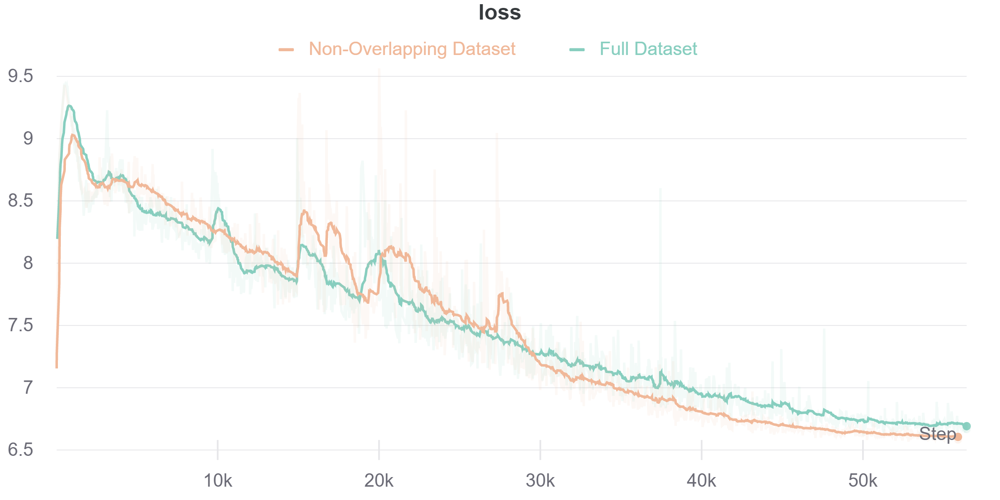

## Abstract

[todo] This will be added last. 

## Introduction
The performance of deep convolutional neural networks depends on their capability and the amount of training data. The datasets are becoming larger in every domain and different kinds of network architectures like [VGG](https://arxiv.org/pdf/1409.1556.pdf), [GoogLeNet](https://arxiv.org/pdf/1409.4842.pdf), [ResNet](https://arxiv.org/pdf/1512.03385.pdf), [DenseNet](https://arxiv.org/pdf/1608.06993.pdf), etc., increased network models' capacity.  

However, the collection and annotation of large-scale datasets are time-consuming and expensive. Many self-supervised methods were proposed to learn visual features from large-scale unlabeled data without using any human annotations to avoid time-consuming and costly data annotations.  Contrastive learning of visual representations has emerged as the front-runner for self-supervision and has demonstrated superior performance on downstream tasks. All contrastive learning frameworks involve maximizing agreement between positive image pairs relative to negative/different images via a contrastive loss function; this pretraining paradigm forces the model to learn good representations. These approaches typically differ in how they generate positive and negative image pairs from unlabeled data and how the data are sampled during pretraining.  

Self-supervised approaches such as  Momentum  Contrast  (MoCo)  ([He et al.,  2019](https://arxiv.org/pdf/1911.05722.pdf);  [Chen et al.,2020](https://arxiv.org/pdf/2003.04297.pdf))  can leverage unlabeled data to produce pre-trained models for subsequent fine-tuning on labeled data.   In addition to MoCo,  these include frameworks such as SimCLR ([Chen et al., 2020](https://arxiv.org/pdf/2002.05709.pdf)) and PIRL ([Misra and Maaten, 2020](https://openaccess.thecvf.com/content_CVPR_2020/papers/Misra_Self-Supervised_Learning_of_Pretext-Invariant_Representations_CVPR_2020_paper.pdf)).  

Remote sensing data has become broadly available at the petabyte scale, offering unprecedented visibility into natural and human activity across the Earth. In remote sensing, labeled data is usually scarce and hard to obtain. Due to the success of self-supervised learning methods, we explore their application to large-scale remote sensing datasets.  

While most self-supervised image analysis techniques focus on natural imagery, remote sensing differs in several critical ways. Natural imagery often has one subject; remote sensing images contain numerous objects such as buildings, trees, roads, rivers, etc. Additionally, the important content changes unpredictably within just a few pixels or between images at the same location from different times. Multiple satellites capture images of the same locations on earth with a wide variety of resolutions, spectral bands (channels), and revisit rates, such that any specific problem can require a different
combination of sensor inputs([Reiche et al., 2018](https://doi.org/10.1016/j.rse.2017.10.034),[Rustowicz et al., 2019](https://openaccess.thecvf.com/content_CVPRW_2019/papers/cv4gc/Rustowicz_Semantic_Segmentation_of_Crop_Type_in_Africa_A_Novel_Dataset_CVPRW_2019_paper.pdf)).  

While MoCo and other contrastive learning methods have demonstrated promising results on natural image classification tasks, their application to remote sensing applications has been limited.  

Unlike contrastive learning for traditional computer vision images where different views (augmentations) of the same image serve as a positive pair, we propose to use positive pairs from different sensors for the same location.    

In this work, we demonstrate that pre-training [MoCo-v2](https://openaccess.thecvf.com/content_CVPR_2020/papers/He_Momentum_Contrast_for_Unsupervised_Visual_Representation_Learning_CVPR_2020_paper.pdf) on data from multiple sensors lead to improved representations for remote sensing applications.

## Related Work
#### Self-supervised contrastive learning
Many self-supervised learning methods for visual feature learning have been developed without using any
 human-annotated labels. Compared to supervised learning methods which require a data pair Xi
 and Yi while Yi is annotated by human labors, self-supervised learning also trained with data Xi along
 with its pseudo label Pi while Pi is automatically generated for a pre-defined pretext task without involving any
 human annotation. The pseudo label Pi can be generated by using attributes of images or videos such as the context of
 images or by traditional hand-designed methods. As long as the pseudo labels P are automatically generated
 without involving human annotations, then the methods belong to self-supervised learning. Recently, self-supervised
 learning methods have achieved great progress.  

 Self-supervised contrastive learning approaches such as [MoCo](https://arxiv.org/pdf/1911.05722.pdf) ,
 [MoCo-v2](https://arxiv.org/pdf/2003.04297.pdf), [SimCLR](https://arxiv.org/pdf/2002.05709.pdf), and [PIRL](https://openaccess.thecvf.com/content_CVPR_2020/papers/Misra_Self-Supervised_Learning_of_Pretext-Invariant_Representations_CVPR_2020_paper.pdf) have demonstrated
 superior performance and have emerged as the fore-runner on various downstream tasks. The intuition behind these
 methods are to learn representations by pulling positive image pairs from the same instance closer in latent space
 while pushing negative pairs from difference instances further away. These methods, on the other hand, differ in the
 type of contrastive loss, generation of positive and negative pairs, and sampling method.

 Contrastive learning of visual representations using MoCo ([**MoCo-v2**](https://arxiv.org/pdf/2003.04297.pdf) - Chen, et
 al., Facebook AI Research, 2020) has emerged as the front-runner for self-supervision and has demonstrated superior performance on downstream tasks.

#### Performance gap in Satellite imagery
There is a performance gap between supervised learning using labels and self-supervised contrastive learning method, [MoCo-v2](https://arxiv.org/pdf/2003.04297.pdf), on remote
 sensing datasets. For instance, on the Functional Map of the World ([fMoW](https://arxiv.org/abs/1711.07846)) image classification
 benchmark, there is an 8% gap in top 1 accuracy between supervised and self-supervised methods. By leveraging spatially aligned
 images over time to construct temporal positive pairs in contrastive learning and geo-location in the design of pre-text tasks, **[Geography-Aware
 Self-supervised Learning](https://arxiv.org/pdf/2011.09980.pdf)** (Ayush, et al., Stanford University, 2020) were able to
 close the gap between self-supervised and supervised learning on image classification, object detection and semantic
 segmentation on remote sensing and other geo-tagged image datasets.

In this work, we provide an effective approach for improving representation learning using data from different satellite imagery using [MoCo-v2](https://arxiv.org/pdf/2003.04297.pdf).

## Problem Definition
Does contrastive pre-training with data from multiple sensors lead to improved representations for remote sensing applications?  

Pre-train the contrastive model using unlabeled data from multiple satellites and use that model for downstream remote sensing tasks.  

We want to show that our approach to using images from different satellites for the same location as naturally augmented images as input to the MoCo-v2 method provides high-quality representations and transferable initializations for satellite imagery interpretation. Despite many differences in the data and task properties between natural image classification and satellite imagery interpretation, we want to show the benefit of MoCo-v2 pretraining across multiple patches from different satellites for satellite imagery and investigate representation transfer to a target dataset.   

### Datasets
- [todo] keep only sen12ms. 
-   
To validate our ideas, we did experiments on datasets with different satellite imageries with variations in dataset size, channels, and image ground resolutions. The statistics of these datasets are given below. Readers are requested to see the the supplementary materials for examples and additional details of these datasets.  
| Dataset  | Satellites  | Number of Images  | Image Size  |  Labels | Notes  |
|---|---|---|---|---|---|
| [BigEarthNet](https://arxiv.org/pdf/1902.06148.pdf)  | Sentinel-2A/B |590,326 patches; 12 Bands | 20x20 to 120x120  | Multiple, up to 43  | No overlapping; 10 European Countries |
| [SEN12MS](https://arxiv.org/pdf/1906.07789.pdf)   | Sentinel-1A/B; Sentinel-2A/B; MODIS (Terra and Aqua)  | 541,986 patches; 180662 triplets (3\*180662); 4, 2 and 13 Bands     | 256X256  | Single, 17 Full and 10 Simplified  | Partial overlapping |
| [FMoW](https://arxiv.org/abs/1711.07846)   | QuickBird-2; GeoEye-1; WorldView-2; WorldView-3  | 1,047,691 patches; 4, 8 and RGB Bands  | Variable Over 2500x2500  | Multiple, up to 63; Bounding Box Annotations | Includes False Detection; Variable timestamp overlapping  |

##### SEN12MS
The SEN12MS dataset contains 180,662 patch triplets of corresponding Sentinel-1 dual-pol SAR data, Sentinel-2 multi-spectral images, and MODIS-derived land cover maps. The patches are distributed across the land masses of the Earth and spread over all four meteorological seasons. This is reflected by the dataset structure. The captured scenes were tiled into patches of 256 X 256 pixels in size and implemented a stride of 128 pixels, resulting in an overlap between adjacent patches.
Only 3847 patches do not have any overlap with adjacent patches.
Most of the overlap occurs around 25% and 50% of the area with few patches overlapping less than 15% and more than 75%.

 All patches are provided in the form of 16-bit GeoTiffs containing the following specific information:
* Sentinel-1 SAR: 2 channels corresponding to sigma nought backscatter values in dB scale for VV and VH polarization.
* Sentinel-2 Multi-Spectral: 13 channels corresponding to the 13 spectral bands (B1, B2, B3, B4, B5, B6, B7, B8, B8a, B9, B10, B11, B12).
* MODIS Land Cover: 4 channels corresponding to IGBP, LCCS Land Cover, LCCS Land Use, and LCCS Surface Hydrology layers.

## Method
In this section, we briefly review Contrastive Learning Framework for unsupervised learning and detail our proposed approach to improve Moco-v2, a recent contrastive learning framework, on satellite imagery from multiple sensors data.

**Multiple-Sensor**
Update on different bands, different satellites etc. with images.  

#### Contrastive Learning Framework
Contrastive methods attempt to learn a mapping fq from raw pixels to semantically meaningful representations z in an unsupervised way. The training objective encourages representations corresponding to pairs of images that are known a priori to be semantically similar (positive pairs) to be closer to each other than typical unrelated pairs (negative pairs). With similarity measured by dot product, recent approaches in contrastive learning differ in the type of contrastive loss and generation of positive and negative pairs. In this work, we focus on the state-of-the-art contrastive learning framework [MoCo-v2](https://arxiv.org/pdf/2003.04297.pdf), an improved version of [MoCo](https://arxiv.org/pdf/1911.05722.pdf), and study improved methods for the construction of positive and negative pairs tailored to remote sensing applications.

#### Naturally Augmented Positive Pairs
Instead of using augmented images of the same input, it is natural to leverage the imagery for the same location from different remote sensing sensors while constructing positive pairs since it can provide us with extra semantically meaningful information.
For example, Sentinel 1 consists of 2 images (vertical and horizontal polarization) and Sentinel 2 consist of 13 images (different wavelength bands) of the same patch.
Any combination from the same patch would corresponds to a positive pair without the need of additional augmentation, while negative pair would correspond to any image from different patch without restriction  of same or different satellite.
Figure 2 shows 19 images from the 3 available satellites at the same patch.\
***INSERT FIGURE HERE***

## Experiments
#### Pre-training on SEN12MS

Pre-training is performed twice for comparison proposes. First, examples from all patches are included (180,662). Second, pre-train includes a sample of the dataset which patches do not overlap with their adjacent patches. This sample of the dataset is selected on firs come first serve basis and any adjacent overlapping patch is ignored. The selection consist of 35,792 patches.

The model is pre-trained on different scenarios to compare the performance of the model. ***First, the model is trained by using the original approach of MoCo V2. The input image is augmented by gaussian blur, elastic transformation, vertical and horizontal flip***. Second, the model with the approach proposed in this work that is using images from different satellites as positive pairs. ***Third, in order to generalize the model, augmentation is applied to both satellites during training***. The pre-train is also done with both the complete dataset and the non-overlapping sample described in the previous section.

The encoders have ***ResNet50*** architecture (50 layers deep, 2048 nodes) with 128 output nodes.
These encoders are designed for a RGB input (3 bands) and Sen12MS data set is 2, 4 and 13 bands for S1, LC and S2 respectively.  
To overcome this structure constrain, a convolutional layer is included before the encoders to map the input with different bands to 3.
***The weights of this layer are not updated during training***.
The momentum constant (***m***) is ***0.9*** and the learning rate is ***0.03***. The temperature factor for the loss function is ***0.2***. The batch size is ***64***.

 Figure ***x*** shows the comparison of loss of the 3 pretrained described. ***The number of epochs for all pre-training is 100***. For this dataset the loss converges very well after 30 epochs for all cases. When using MS as positive example without augmentation (current approach), the loss is significantly lower that the base pre-train (original implementation). When including augmentation for additionally to MS images the loos is slightly lower than without augmentation.    

#### Transfer Learning Experiments
Will be updated once the tasks are identified.

1. SEN12MS - Supervised Learning Benchmark - Classification

| Backbone  | Land Type  | Modalitities  | Bactch size  | Epochs | Overall Accuracy (%) | Average Accuracy (%) | Macro-F1 (%) | Micro-F1 (%) |
|---|---|---|---|---|---|---|---|---|
|DenseNet|single-label|_s1s2|64|100| - |51.16|50.78|62.90|
|DenseNet|single-label|_s2|64|100| - |54.41|52.32|64.74|
|ResNet50|single-label|_RGB|64|100| - |45.11|45.16|58.98|
|ResNet50|single-label|_s1s2|64|100| - |45.52|53.21|64.66|
|ResNet50|single-label|_s2|64|100| - |57.33|53.39|66.35|
|ResNet50|multi-label|_RGB|64|100|58.35| - |47.57|66.51|
|ResNet50|multi-label|_s1s2|64|100|64.32| - |57.46|71.40|
|ResNet50|multi-label|_s2|64|100|60.99| - |56.14|69.88|

## Conclusion

## References  
TODO: Use APA style later. Do this once the draft is ready by taking the links in the document, giving them a number and use APA style generator.  
[1]  
[2]  
[3]  
[4]  
[5]  
